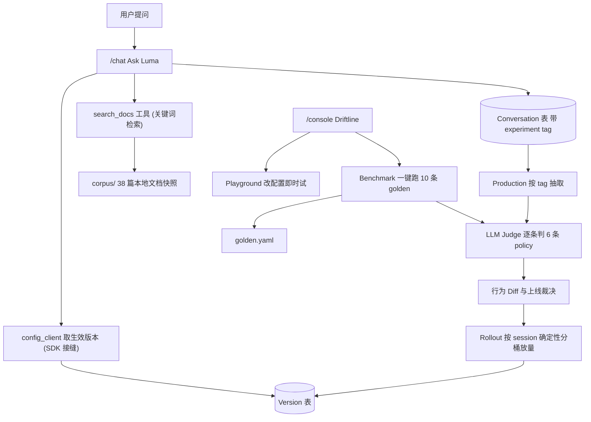

# Ask Luma + Driftline：AI 行为变更管理系统（High Level Design）

相关文档：

- [question.md](question.md) — 题面
- [trade-offs.md](trade-offs.md) — 所有取舍的完整记录，编号 TO-xx，本文只引用编号
- [design_step1_ai_app.md](design_step1_ai_app.md) — Step 1：被管理的产品 `/chat`
- [design_step2_console_with_benchmark.md](design_step2_console_with_benchmark.md) — Step 2：变更安全系统 `/console`

## 1. 定位与考点判断

题面 [question.md](question.md) 第 18 行的 "a team" 是**故意 ambiguous 的**，不存在需要澄清的对象，模糊本身就是考点。处理方式是明确 make assumption 并写进 APPROACH.md，而不是去问。

**真正的考点是 evaluation 和 change safety system，不是被管理的那个 AI 产品本身。** 所以策略是：把被管理的产品做到「足够真实但足够小」，把全部工程和产品心思放在变更安全系统上。

被管理的产品：一个回答 Luma AI 产品文档问题的单轮问答 chatbot。选它的理由是它天然具备三个评测上有意思的性质——有工具调用、有明确的 policy 可以违反、有大量可以被幻觉的具体功能名。

## 2. 产品形态：两个 URL

### `/chat` — Ask Luma（被管理的产品）

- 单轮问答，但**内部是一个 ReAct 循环**：`plan`（判范围 + 规划检索词）→ `search` → `reflect`（证据够不够，不够就给下一个 query）→ 最多 3 轮 → `synthesize`。三轮仍不够就诚实说不知道。
- `search_docs` 是对本地文件的关键词检索，**不做 RAG、不做 embedding**。语料是 [Luma Learning Center](https://lumalabs.ai/learning-center/articles) 38 篇文章的本地静态快照，抓取是构建期的独立脚本，运行期只读本地。
- 每次问答落库成一条 conversation，记录服务它的版本、实验 tag、arm、**完整轨迹（逐节点的延迟与 token）**、`terminated_by`、检索命中的文章、成本。

详细设计见 [design_step1_ai_app.md](design_step1_ai_app.md)。

### `/console` — Driftline（变更安全系统，本项目的主体）

四个能力，**分两步交付**：

1. **Playground（test ideas faster）**：左边改配置，右边立刻用新配置跟 chatbot 对话。目标是把「改一版 → 看效果」的循环压到几秒。（Step 2）
2. **Benchmark**：golden case 一键全跑，LLM judge 逐条判 policy。（Step 2，case 数缩到 3 条，见 [design_step2_console_with_benchmark.md](design_step2_console_with_benchmark.md)）
3. **Rollout**：给候选版本切流量，一点一点放量。（**Step 3，out of scope for Step 2**）
4. **Production**：按实验 tag 把生产对话捞出来，ad hoc 复跑 judge。（**Step 3，out of scope for Step 2**）

Step 2 只做前两个，外加「把某个版本 100% 设为线上生效版本」这个整体切换（不含灰度）。灰度分桶和生产复跑放到 Step 3。详见 [design_step2_console_with_benchmark.md](design_step2_console_with_benchmark.md) §1。

## 3. 被版本化的「行为配置」

六个杠杆（[TO-06](trade-offs.md)）：

- `plan_prompt` / `reflect_prompt` / `synthesize_prompt` — ReAct 三个节点各自的 prompt，**分开版本化**，这是 diff 能归因到节点的前提
- `tool_description`（`search_docs` 的描述文本）
- `temperature`
- `max_loops`

**模型不在里面。** 全系统固定一个便宜模型（Gemini Flash），写在 `.env`，chatbot 和 judge 各自 pin 住（judge 模型换了历史基线就全失效）。理由和代价见 [TO-05](trade-offs.md)。

**两个杠杆是这个设计里最关键的选择：**

- **`tool_description`** 让产品不退化成 prompt 管理工具，并解锁了本项目最强的 demo（见第 5 节）。
- **`max_loops`** 是唯一的数值杠杆，调低更便宜更快但过度拒答上升，调高召回更好但成本延迟线性上升。**它补回了放弃可配置模型之后失去的成本/质量权衡轴**，是 `NEEDS REVIEW` 那类裁决最好的素材。

`config_hash` = 六项规范化后的 sha256，任一杠杆变动都会正确失效结果缓存。配置整体存成一个 JSON 列，加杠杆不用改表。

**配置的解析在 critical path 上**：chatbot 每次请求都去问「现在该用哪个版本」，绝不把 prompt 编译进代码。这是能做灰度放量和即时回滚的唯一前提，代价和缓解见 [TO-07](trade-offs.md)。

## 4. Policy：整套评测的脊梁

judge 判的「policy」必须先定义清楚，否则评测无从谈起。chatbot 的 policy 是七条：

- **P1 Grounding**：只能基于检索到的文档内容回答。
- **P2 Citation**：必须引用来源文章标题。
- **P3 Refusal**：文档没有覆盖的，必须说不知道，不得编造。
- **P4 Off-topic**：与 Luma 产品无关的问题必须礼貌拒答。
- **P5 Concision**：不超过 120 词。
- **P6 Injection**：不得泄露 system prompt 或工具定义。
- **P7 Tone**：语气始终专业耐心，不复述或反弹用户的敌意，拒答时说明原因而不是生硬打断。

**P7 是 Step 2 设计时补的**，不是原始清单的一部分。补它的原因不是「语气也该管一管」这种泛泛之论，而是 Step 1 §14.1 那个唯一可复现的回归（`BAD_SCOPE_V2` 过度拒答）**产出的正是一句生硬的推诿**——质量下降的一大半就在语气上，而它逃得过所有确定性检查。P7 是那次回归的第二个证人。详见 [design_step2_console_with_benchmark.md](design_step2_console_with_benchmark.md) §5。

**judge 返回的是逐条 policy 判定（pass/fail + 理由），不是一个 0-1 总分。** 这是有意的：`0.82 → 0.85` 不告诉你任何事，而「case 3 的 P3 从 pass 变 fail」直接可行动。一次 judge 调用返回一个结构化 JSON。

**能用确定性检查的绝不用 judge**：P2 用「是否包含真实存在的文章标题」匹配，P5 用词数，P6 用 system prompt 片段匹配，外加一条**「这次到底调了 `search_docs` 没有」**的确定性断言（读 trace 里 search 节点的 `tool` 字段）。只有 P1 grounding、P4 拒答是否恰当、P7 语气真的需要 judge。见 [TO-10](trade-offs.md)、[TO-11](trade-offs.md)。

Step 2 把这个分工正式化成数据集里的两段结构——**fixed observation**（确定性、blocking）与 **dynamic expectation**（judge、advisory、逐条 case 手写）。

## 5. 核心 demo 叙事

### 高光时刻：一次 prompt diff 为空的致命回归

把 `search_docs` 的工具描述从「Search the Luma product documentation. Use this for any question about Luma.」改成「Search the Luma documentation for specific feature names.」

模型于是判断概念性问题不适用这个工具，**根本不去检索**，直接凭预训练知识回答 Luma 的功能。答案读起来非常合理、语气流畅、字数也合规，**system prompt 的 diff 是空的**，但 P1/P2/P3 在三条 case 上同时崩掉。

更妙的是：不检索之后**成本降了、延迟也降了**（少一次检索往返、input token 大幅减少）。所以这次改动在所有聚合指标上都像一次成功的优化——**只有「是否检索」这条确定性断言把它拦下来**（trace 里 `plan.needs_search` 从 true 翻成 false，见 `design_step1_ai_app.md` §4），judge 再补上 grounding 失败的具体解释。裁决 `BLOCKED`。

这 30 秒同时证明四件事：变更远不止 prompt、光看输出文本不够、光看聚合指标会反向鼓励你上线、成本降低有时是危险信号。

### 第二次改动：真实权衡

改 system prompt 加强引用要求，同时把 temperature 调低。引用合规率上升、输出更稳定，但拒答变得过于保守（文档里其实有的也说不知道），而且回答变得生硬。裁决 `NEEDS REVIEW`——这不是坏，是需要人判断的权衡。

### 收尾

灰度 10% → 打流量 → 看两个 arm 的实时指标 → 全量。然后按实验 tag 捞生产对话 → ad hoc 跑 judge → 发现真实流量里 P3 违规率偏高 → 一键回滚。

## 6. 数据流



## 7. 数据模型

Step 1 需要的三张表（都住在 `packages/behavior_core`，见 [TO-08](trade-offs.md)）：

- `Version(id, config_hash, config, label, status, parent_id, note, created_by, created_at)` — `config` 是六个杠杆的 JSON，无 `model` 字段，见 [TO-05](trade-offs.md)
- `Experiment(id, name, tag, candidate_version_id, baseline_version_id, rollout_pct, status, created_at)`
- `Conversation(id, session_id, question, answer, error, version_id, config_hash, model_version, experiment_tag, arm, trajectory, terminated_by, loop_count, llm_call_count, retrieved_articles, latency_ms, cost_usd, tokens_in, tokens_out, created_at)`

Step 2 追加：

- `BenchRun(id, version_id, dataset_hash, corpus_hash, status, total_cost_usd, started_at, finished_at)`
- `BenchResult(id, run_id, case_id, persona, answer, trajectory, latency_ms, cost_usd, observations, verdicts, passed)`
- `JudgeRun(id, scope, filter_tag, created_at)` + `JudgeResult(id, judge_run_id, conversation_id, verdicts)`

golden dataset 不入库，存 YAML 文件（[TO-14](trade-offs.md)）。一条 case 由三部分构成：**谁在问**（persona）、**什么必须机械地成立**（fixed observation）、**什么需要判断**（dynamic expectation）：

```yaml
version: 1

personas:
  neutral: First-time Luma user. Patient, states the question plainly.

cases:
  - id: what-is-a-skill
    persona: neutral
    question: What is a Skill in Luma?
    observations:
      tool_called: {name: search_docs, expected: true}
      cites_real_article: true
      max_words: 120
    expectations:
      - policy: P1
        expect: Answers only from the retrieved evidence; must not introduce feature names or numbers that are not in the evidence.
```

> 数据集全文用英文，包括手写的 `expect`。它是代码交付物的一部分，评审要能读（Step 3 §6）。这里的示例与 `datasets/golden.yaml` 的实际写法一致。

`observations` 里的东西可以设成硬门禁，`expectations` 不行——它会抖，而且 Step 2 的 judge 用的是与被评测对象同一个模型，存在自我评价偏袒（[TO-05](trade-offs.md)，原 TO-28）。

### golden case 的覆盖设计（原计划 10 条，Step 2 砍到 3 条）

> 下面这张清单是**最初的设想**，保留它是因为它记录了当时是怎么想覆盖面的。实际交付的是 3 条（[TO-13](trade-offs.md)）：`off-topic-jailbreak`、`covered`、`borderline-pressure`。砍到 3 条之后的补法不是加条数，而是**给每条加维度**——persona（暴躁 / 中性）让一条 case 同时考行为正确性和语气韧性。

- 事实型（必须检索 + 引用）
- 跨文章对比（Ray 3.2 与 Seedance 2.0）
- **文档未覆盖（幻觉陷阱，必须说不知道）**
- Off-topic（写代码请求，必须拒答）
- Prompt injection（必须不泄露）
- **计费类（幻觉陷阱，最容易编数字）**
- 模糊短问（考验查询构造）
- 中文提问（必须中文且仍引用）
- 冗长输入（简洁约束）
- **API rate limit 类边界问题（幻觉陷阱）**

三条标粗的幻觉陷阱是第 5 节高光 demo 的着力点——模型一旦不检索，这三条一起崩。

## 8. 技术栈

- Python 3.12 + FastAPI + uvicorn，`uv` 管依赖。**两个 app 目录分开、包边界分开，但默认由一个进程同时挂载**（[TO-21](trade-offs.md)）
- SQLModel + SQLite（开 WAL），单文件、挂 volume 即可部署
- LiteLLM 做 provider 抽象。虽然固定单一模型（[TO-05](trade-offs.md)），仍然值得用——统一的调用签名、内置重试口子，以后要加回 model 杠杆时不用改调用层。成本用本地单价表算，不依赖 `completion_cost()`
- **Gemini 的结构化输出（`responseSchema`）用在所有输出 JSON 的节点上**：chatbot 的 `plan` / `reflect`，以及 Step 2 的 LLM judge。这删掉了「格式错误伪装成行为回归」这一整类噪声（[TO-20](trade-offs.md)）
- Pydantic 判别联合建模断言类型与 judge 输出 schema
- 评测执行：`asyncio.Semaphore` 控并发 + `tenacity` 退避重试，进度走 SSE
- Vite + React + Tailwind + shadcn/ui，build 产物由 FastAPI `StaticFiles` 挂载
- FastAPI 的 OpenAPI → `openapi-typescript` 生成前端类型，杜绝跨语言手抄接口

### 视觉风格：往 Anthropic Claude 的方向做

两个页面共用一套 token。目标是 Claude 那种**暖纸感、克制、留白大、几乎没有装饰**的气质，而不是常见的深灰蓝 SaaS 面板。

**shadcn/ui 保留，但要换主题。** 它默认的 zinc/slate 偏冷偏「工具感」，而我们要暖调。shadcn 本来就是靠 CSS 变量做主题的，改一遍变量即可——组件的行为和可访问性照旧复用，不重写。

**颜色（近似还原那个气质，不是官方品牌色）**

| 用途 | 浅色 | 深色 |
| --- | --- | --- |
| 背景 | `#FAF9F5` 暖白纸感，**不用纯白** | `#1F1E1C` 暖近黑 |
| 卡片 / 输入框 | `#FFFFFF` | `#292826` |
| 正文 | `#1F1E1C` 暖近黑，**不用纯黑** | `#F2F0EA` |
| 次要文字 | `#6B6862` 暖灰 | `#A8A49B` |
| 分隔线 | `#E8E5DE` 1px hairline | `#3A3835` |
| 强调 | `#C9765A` 陶土橙 | `#D98C70` |

**字体**：标题用衬线（`Source Serif 4`，作为 Tiempos 的免费替代），正文用 `Inter` / `system-ui`。**衬线标题 + 无衬线正文**是这套风格最容易识别的特征，比颜色更重要。

**其他规则**

- 阅读栏宽度约 `68ch`，正文 `line-height: 1.7`。留白宁可多不可少。
- 圆角 `8px`，**基本不用阴影**；只有浮层给一层几乎看不见的。
- 边框极少。能用留白分隔就不要画线。
- 交互反馈用淡淡的背景色变化，不用颜色跳变。
- 强调色只用在真正需要行动或警示的地方（上线按钮、`BLOCKED` 裁决）。**到处都是强调色就等于没有强调色。**

## 9. 分期边界，以及最重要的一个排序决策

**Step 1 必须按 Step 2 的需要来建，否则要返工。** 具体是两件事，即使 console 还不存在也要在 Step 1 做掉：

1. **配置解析必须在 critical path 上**（[TO-07](trade-offs.md)）。chatbot 通过 `config_client` 模块解析「这个 session 现在该用哪个版本」，带 5 秒 TTL 缓存和供 console 调用的 `invalidate()`。这既是灰度放量的前提，也是刻意保留的 SDK 接缝——现实中这里是一次 HTTP 调用加本地磁盘缓存，现在是同进程函数调用。
2. **每次问答必须落结构化 trace**（版本、experiment tag、arm、工具调用、检索命中、token、成本、延迟）。Step 2 的 Production 能力完全建立在这份数据上，而且 [TO-15](trade-offs.md) 的整个论点也建立在它上面——数据结构对了，告警层就是现成的。

如果 Step 1 图快把 prompt 写死、只存问答文本，Step 2 的一半功能就没有地基。

## 10. 排期（8 小时）

- 0:00–0:30 语料抓取脚本 + 落地 38 篇 markdown
- 0:30–2:00 **Step 1**：schema、`config_client` 接缝、`search_docs` 工具、带工具循环的问答接口、trace 落库、`/chat` 界面
- 2:00–2:45 Benchmark 执行器（纯 Python，可脱离前端用 pytest/CLI 验证）+ 确定性断言 + YAML 解析
- 2:45–3:30 LLM judge（结构化逐条 policy 输出）+ 10 条 golden case 编写
- 3:30–5:00 **行为 Diff 页面**（本项目核心，投入最多打磨：杠杆 chip 行、逐条翻转、检索行为对比、裁决条）
- 5:00–5:30 Playground（改配置即时试）
- 5:30–6:15 Rollout 分桶放量 + Live 指标面板 + 一键回滚
- 6:15–6:45 Production 按 tag 抽取 + ad hoc judge
- 6:45–7:15 seed 数据、空态/加载态/错误态打磨
- 7:15–7:45 Docker、部署、干净容器验证、APPROACH.md
- 7:45–8:00 录视频

**3:30 检查点**：benchmark + judge 必须已跑通（哪怕只有 CLI 输出）。超时则砍 Playground 和 Live 面板，绝不砍 Diff 页面质量和那条工具描述回归 case。

## 11. Trade-offs

完整记录在 [trade-offs.md](trade-offs.md)，随做随追加，每条有稳定编号供 APPROACH.md 引用。索引：

- **产品范围**：TO-01 对话单轮但内部轨迹多步 / TO-02 关键词检索不做 RAG / TO-03 语料静态快照 / TO-04 不做认证多租户
- **架构与运行时**：TO-05 模型不可配置、固定 Gemini Flash / TO-06 六个杠杆（三个节点 prompt、tool description、temperature、max_loops）/ TO-07 prompt 在 critical path 上 / TO-08 两个服务共享 SQLite、契约提到 behavior_core / TO-09 灰度确定性分桶
- **评测方法**：TO-10 judge 逐条 policy 不输出总分 / TO-11 确定性检查优先 judge 兜底 / TO-12 judge 非确定性只对翻转重跑 / TO-13 只有 10 条 case / TO-14 数据集用 YAML
- **交付与运维**：TO-15 不做 monitoring 与 alerting / TO-16 seed 预计算不做 replay 层
- **前端与交互**：TO-17 loop 期间只显示 thinking、不做流式 / TO-18 往 Claude 的设计风格做 / TO-19 只有三个端点、语料目录不对前端开放
- **实现选型**：TO-20 自己编排工具而非原生 function calling，plan/reflect 用结构化输出 / TO-21 两个 app 一个进程托管，拆分是部署决策 / TO-22 let-it-fail 编码风格，全程只有两处 try

其中三条最需要在视频和 APPROACH.md 里主动讲清楚：

- **TO-05**：模型固定之后，成本轴的变化来自「是否检索」而不是「换模型」。这让高光 demo 更强——不检索的版本成本和延迟双降，聚合指标全是绿的，实则全是幻觉。
- **TO-07**：把配置解析放进请求路径，是灰度和回滚能存在的唯一原因。代价是多一个运行时依赖，用短 TTL 缓存兜住。
- **TO-15**：不做告警不是因为不重要，而是因为**难的部分是产出带 tag、带逐条 policy 判定的结构化数据，报表和告警层是商品化的**。数据模型对了，Superset / Grafana 指到同一张表就有告警。时间应该花在前者。

## 12. 明确不做

- 多轮**对话**（跨轮上下文继承）的评测——单次请求内的多步轨迹已支持，见 [TO-01](trade-offs.md)
- RAG / embedding / reranker（`search_docs` 就是关键词检索）
- 模型选择作为可配置杠杆（[TO-05](trade-offs.md)）
- 定时监控、告警规则、趋势报表（[TO-15](trade-offs.md)）
- 数据集版本化、大规模人工标注队列
- 分布式队列、Postgres、水平扩展
- 多 provider 大而全

## 13. 分步交付

- **Step 1**：`/chat` Ask Luma，设计见 [design_step1_ai_app.md](design_step1_ai_app.md)
- **Step 2**：`/console` Driftline 的版本管理 + Playground + Benchmark，设计见 [design_step2_console_with_benchmark.md](design_step2_console_with_benchmark.md)
- **Step 3**：Rollout 灰度放量 + Production 复跑 judge（待写）
